# F16Sim文档笔记

### 前言：先说下整个F16_emulation的文件夹情况

* F16Sim就是对F-16战斗机飞行仿真的文件，文件来源于[Software Enabled Control (umn.edu)](https://dept.aem.umn.edu/~./faculty/balas/darpa_sec/SEC.Software.html)，准确来说是Non-Linear F-16 Aircraft Model。并且已经对nlplant.c进行修改（删除break），可以顺利编译通过
* 老规矩assets存放的是.md格式里面的相对路径的图片，README.md就是你现在打开的这个文件啦
* F16Manual.pdf也是上面那个网址下载下来的，关于F16Sim这个文件的描述

比较糟糕的是，这个pdf文档貌似有限制，不能直接完全翻译成中文，甚至不能复制，只能拿截图翻译去一点点看，但在2024年，网易有道还不能很精准的去翻译一些专业名词，为了方便自己后续查看资料，也为了后来人能更快的上手这一套的仿真，我对整个文档比较拗口难懂的模型原理部分进行了翻译（可能也有部分翻译的不是很准确，相信后来人）。不过我建议就是，不要只看我翻译的中文版本（因为我不能保证我翻译的一定是对的），最好自己仔细看遍英文版本。

## 二、F-16模型解剖

### 2.1 机身轴体

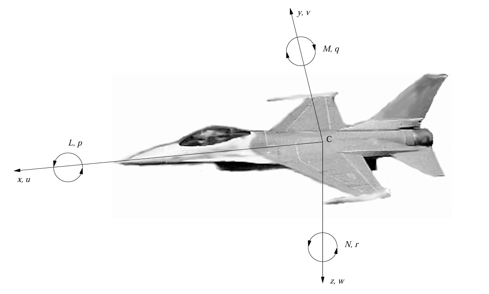

* 坐在驾驶舱里面对飞机的前部，y轴的正方向是在右侧机翼方向，z轴的方向是飞机水平飞行时垂直向下。
* 力矩轴服从每个轴的右手定则，x、y、z轴的力矩分别标记为M、L和N，L=滚转力矩，M=俯仰力矩，N=偏航力矩。
* 体速率（p，g和r），p=滚转速率，q=俯仰速率，r=偏航速率
* 欧拉角（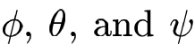)

### 2.2 系统

F16的模型需要4个控制，13个状态，前缘襟翼偏转和一个模型旗作为输入，然后该仿真输出十二种状态衍生物和6种其他飞行状态。

### 2.3 状态

**13个的状态输入分别是：**

* 北侧位置（npos）
* 东侧位置（epos）
* 高度（h）
* 横滚角（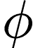)
* 俯仰角（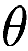)
* 偏航角（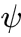)
* 总速度（V~t~）
* 攻角（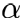)
* 侧滑角（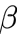)
* 横滚速率（p）
* 俯仰速率（g）
* 偏航速率（r）
* 前缘襟翼偏转度（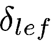)

不过前缘襟翼偏转只在高保真模型中实现

**整个仿真的输出是**

x、y、z方向（a~nx~，a~ny~，a~nz~）的12个状态导数和加速度、马赫数（M）、自由流体动压（$\overline{\text{q}}$​）、静压（P~s~）

F-16的初始状态构成了F-16初始条件，可以任意输入他们。

不过更有可能的是，初始状态将由修剪程序（？总觉得这样翻译很奇怪，但不知道怎么翻译更好）提供。程序给定高度和速度去稳态飞行，仿真可以在最初的四个状态进行调整（稳定水平、转弯、上拉、翻滚飞行）。

通过对12个输出状态导数的积分得到12个输入状态

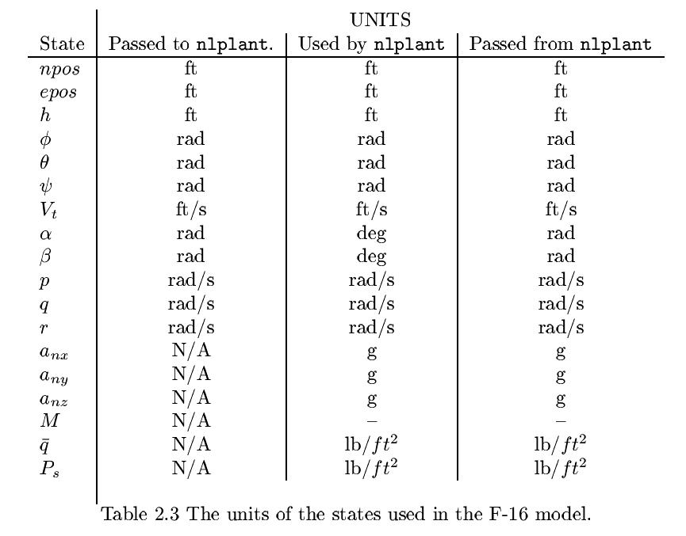

### 2.4 控制

F-16的控制是来自于推力、升降舵、副翼和方向舵，推力单位是磅。推力沿着x轴正向作用，正推力导致沿身体x轴的加速度增加。对于其他控制面，正偏转使体速率降低，副翼的正偏转会降低横滚速率p，而这要求右副翼向下偏转，而左副翼向上偏转。升降舵的正向偏转导致俯仰速率q降低，因此升降舵向下偏转。方向舵的正偏转降低了偏航速率r，可以被认为偏向了右边。

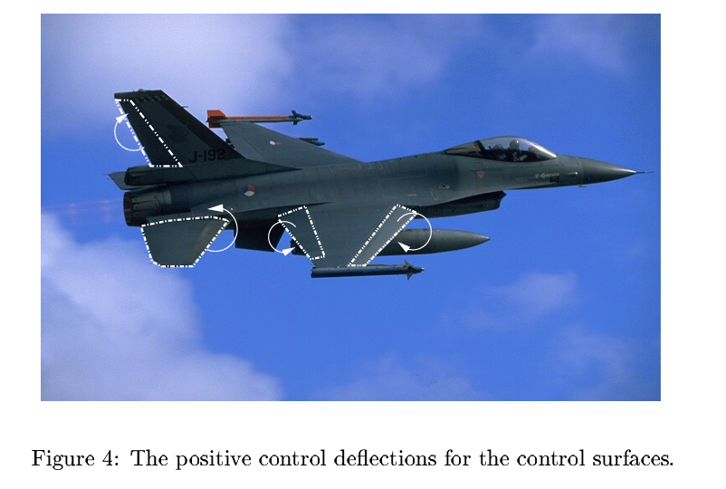

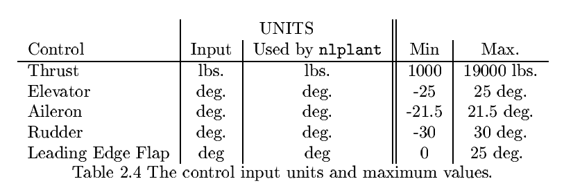

高保真模型有一个额外的控制面，允许F16以一个更大的攻角飞行，但是这个控制面不可以直接被飞行员直接改变。相反，F16飞行时候的攻角、动压、静压来控制这个面的偏转。控制前缘襟翼偏转的传递函数：

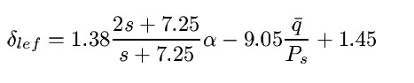

为了了解前缘襟翼的效果，可以看看F-16线性化装置，包括有和没有前缘襟翼的情况。下面这个等式的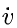是从使用了前缘襟翼的线性化高保真模型中得到，其中高度为15000ft，速度为500ft/s。（注：ft为英尺）

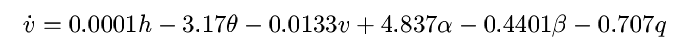

在相同的线性化高保真模型中，同样的飞行条件，但没有前缘襟翼：

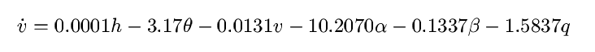

同样的飞行条件，从线性化低保真模型中得出下面的等式

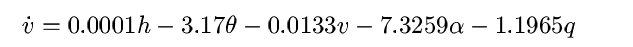

从这些方程中需要注意的一点就是，当使用前缘襟翼时，速度变化率实际上随着攻角的增加而增加，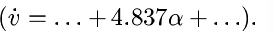当没有前缘襟翼的时候，速度随着攻角的增加而减小，这个情况在大多数传统飞机上很常见。这再次确认了前缘襟翼正在做应该做的事情，也就是说，允许F16以一个大攻角飞行

### 2.5 驱动器

所有的驱动器都被建模为具有增益（K）和偏转、速度限制的一阶滞后。推力有个单位增益和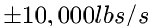的速度限制。升降舵的增益为1/0.0495，速度限制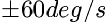。副翼增益为1/0.0495，速度限制为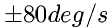。方向舵增益为1/0.0495，速度限制为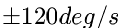。前缘襟翼的增益为1/0.136，速度限制为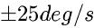。

### 2.6 低保真模型和高保真模型的区别

两者都使用了相同的导航方程和运动方程，导航方程摘抄自Stevens and Lewis的第81页，决定了力和力矩系数的方程取自NASA报告的第37-40页

包含这些方程的文件是nlplant.c，在浏览nlplant.c文件的时候，可以在214行，清晰的看出低保真模型和高保真模型的差异，每个模型使用了不同的表格来计算力和力矩系数，用于计算力和力矩系数的气动数据通过攻角、侧滑教和某些情况下升降舵偏转的函数形式制成表格，然后，通过给定攻角、侧滑角和升降舵偏转的整体进行插值，得到力和力矩系数，表格中的数据来自于NASA langley的风洞实验数据。

低保真气动数据来自Stevens和Lewis的附录，高保真气动数据表格来自NASA报告的表三。低保真度模型和高保真度模型的气动表可以在文件lofi_F16_AeroData.c和hifi_F16_AeroData.c中找到。

低保真模型是一个不包括前缘襟翼影响的简单模型，纵向和横向之间完全不耦合，低保真模型的攻角范围为-10~45度，侧滑角范围为-30 to 30度。

高保真模型包含了前缘襟翼的影响，并且在纵向和横向之间存在明显的耦合，就像一个真实的飞机一样，高保真模型的攻角范围为-20 ~ 90度，侧滑角范围为-30 to 30度。

## 三、安装说明

在windows平台下会生成nlplant.mexw64（文档说的是Linux环境生成 .mexglx）

因为nlplant.c 是用c写的脚本，必须添加nlplant.mexw64才能在matlab环境中使用。

## 四、F-16 Simulation文件

### 4.1 F-16 Simulation文件（按照文件名）

##### ==F16Block.mdl==

这个文件是F-16的Simulink模型，该模型的核心是包含函数nlplant.c的功能块，这个功能块将执行由matlab的mex函数nlplant创建的文件， 创建的文件有一个平台相关的扩展名，如下表所示：

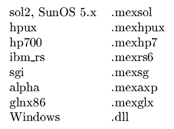

（应该来说，一般都是windows的.dll吧）

如果提供了所有的合适参数，可以直接从simulink运行此模型，或者可以在matlab中使用runF16Sim命令。不过，文档比较推荐使用后面一种方案，因为可以在给定的高度和攻角修改F-16，然后运行模型并绘制结果。

##### ==runF16Sim.m==

在matlab的命令行输入runF16Sim，就可以运行这个文件

该程序使用名为F16Block.mdl的Simulink模型运行仿真

程序将做什么：当执行时，程序将提示用户运行哪个模型，用户还可以选择在任何控制面上创建干扰。可以将模拟、以及结果绘制保存在文本文件中，格式为：

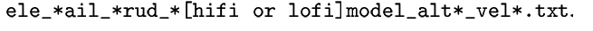

##### ==trim_F16.m==

用于在给定初始高度和速度的稳态飞行条件下调整F-16的函数。这个函数最小化了由trimfun.m创建的成本函数，通过评估由用户提供的初始条件的自由参数。自由参数包括了推力、升降舵、方向舵和副翼偏转和迎角。文档对于调整飞行条件的初步猜测是，在指定高度和速度下找到平衡点可能是至关重要的。下载中提供的所有程序都使用相同的初始猜测。最初的估计是5000磅，升力设置为-0.09度，攻角为8.49度，方向舵偏转为0.01度，副翼偏转为0.01度。这些值提供了一个很好的起点。它允许trim_F16在大多数情况下相对较快地收敛到一个调整点上。文档的作者使用这些初始猜测尝试的所有情况都找到了平衡点，如果试图在极端飞行条件下调整F-16，这些值可能也不需要修改。注意的是：如果需要更改任何初始条件的值，可以在runF16Sim.m或者runLINF16.m中修改。

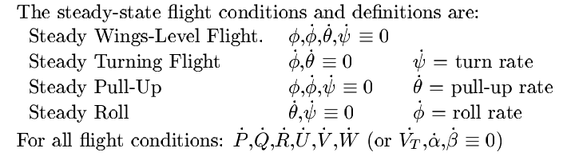

##### ==trimfun.m==

trim_F16的函数，创建的代价函数将被Matlab的函数fmisearch最小化，fmisearch尝试使用迭代技术来查找trim_F16给出的自由参数的值，该技术调整每个自由参数，直到所有状态导数都最小化。成本函数为：

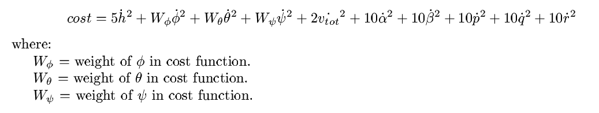

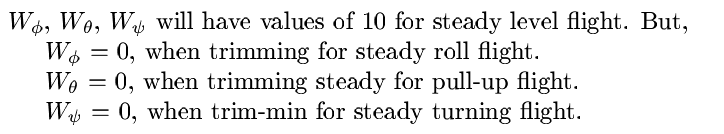

##### ==nlplant.c==

是F-16仿真的核心，包含了所有控制F-16动力学的方程（即F-16动力学），如运动方程、导航方程。

##### ==lofi_F16_AeroData.c==

包含nlplant.c调用的所有函数，以确定低保真模型的表格形式的空气动力学数据

##### ==hifi_F16_AeroData.c==

包含了nlplant.c调用的所有函数，以确定高保真模型的表格形式的空气动力学数据。

##### ==mexndinterp.c==

创建c函数，允许nlplant.c快速插入低保真度和高保真度的空气动力学表

##### ==LIN_F16Block.mdl==

对于低保真度模型和高保真度模型，使用simulink模型runLINF16对模型进行线性化，该模型包含可能影响线性化过程的饱和块。

##### ==runLINF16sim.m==

在matlab的命令行输入runLINF16sim

程序功能：当执行runLINF16sim.m时，将使用simulink模型LIN_F16Block.mdl，然后以类似的方式，如runF16sim，他会提示用户者进入调整条件（高度和速度）为F-16模拟。

##### ==FindF16Dynamics.m==

执行FindF16Dynamics.m将对高保真度和低保真度模型进行线性化，为F-16飞机创建线性时不变（LTI）模型，然后，它将LTI模型分解为纵向和横向方式模式，找到每个模式的极点和相应的阻尼比和固有频率，创建极点零映射，并根据给定的控制面和推力创建每个状态的波特图。要求：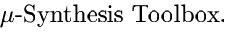

## 五、使用F-16模型

文档中的F16系统的用途有：

1. 使用非线性模型可以直接看到F16对不同控制输入的响应
2. 该装置，使经典和现代的控制设计方法可以应用，这些方法包括：根轨迹法、伯德图法
3. 对F16的非线性装置进行线性化，并用它来分析F16的纵向和横向方向动力学

### 5.1 直接使用非线性F16模型

#### 5.1.5 程序执行函数trim_F16，trim_F16将提示您进入所需的稳态飞行状态

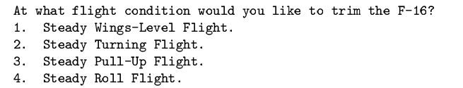

如果选择输入1，调整F-16在稳定的机翼水平飞行。trim_F16试图通过最小化式1描述的成本函数来找到平衡点。它通过改变推力和不同控制面来做到这一点，直到导数为0。迭代几次后，trim例程将退出，因为已经达到了最大迭代次数，或者数值已经收敛。退出后，它将显示当前的成本，控制和攻角值。结果会显示如下：

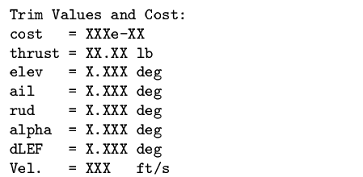

### 5.2 对非线性化的F16系统进行线性化

非线性的F16系统可以线性化，线性化模型可用于仿真或用于控制设计。线性化模型允许应用经典和现代控制设计方法。runLINF16Sim将线性化F16模型并将状态空间矩阵写入文件以供以后使用。它还将使用线性化模型运行模拟。如果存在非线性仿真文件，那么runLINF16Sim将在一个图上绘制所有结果。

### 5.3 F16纵向和横向方向模态分析

FindF16Dynamics将线性化整个F16模型，然后提取纵向和横向方向模式。FindF16Dynamics将给出纵向和横向方向状态空间模型的极-零映射。还将显示每个状态到控制面的伯德图

