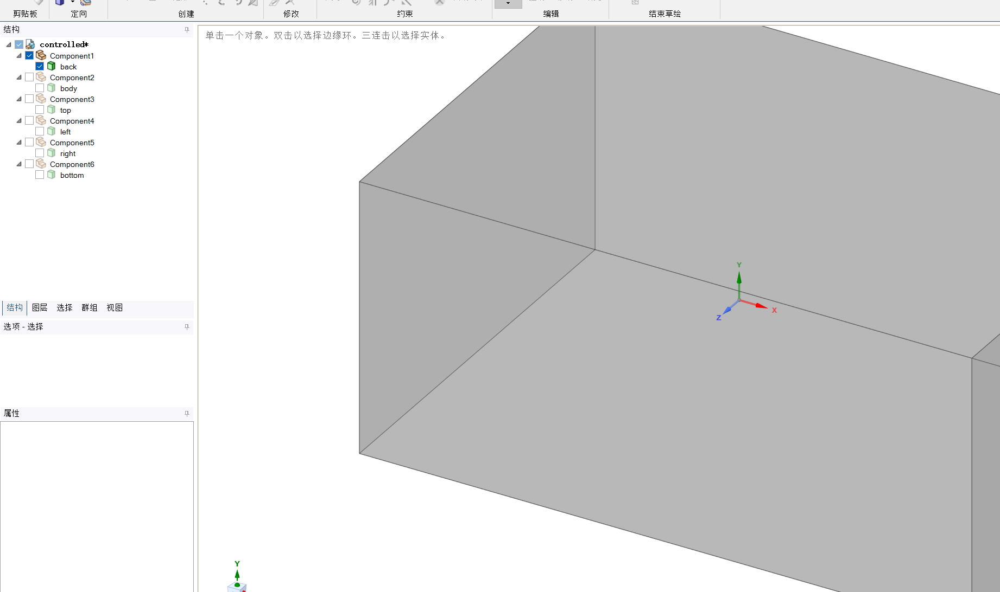
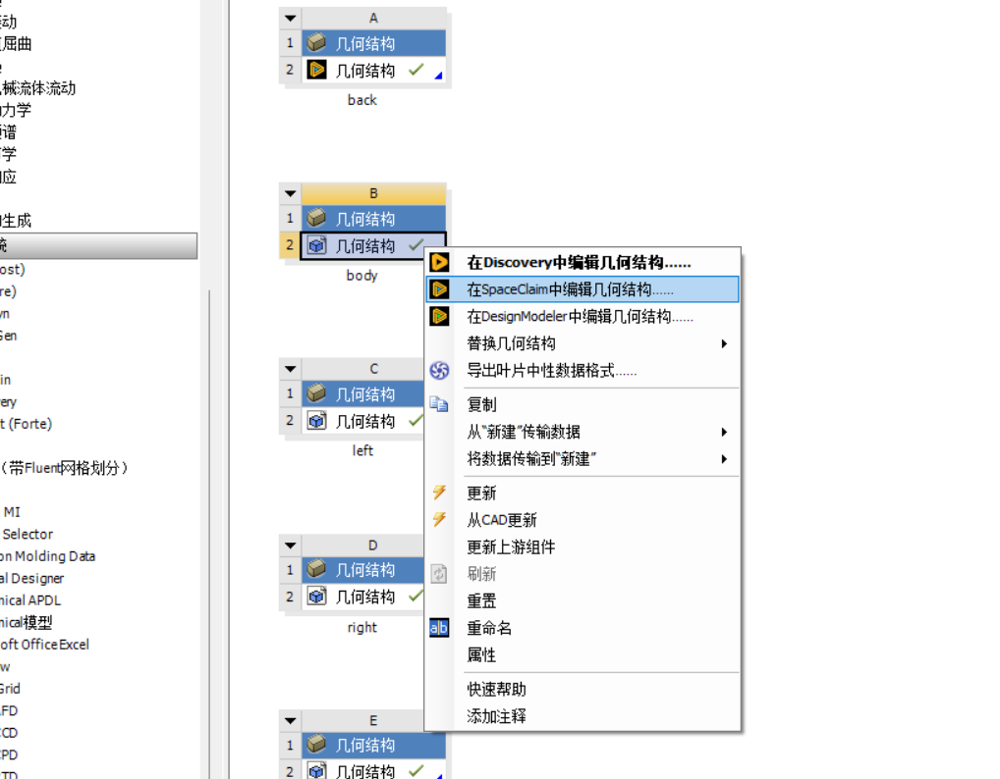
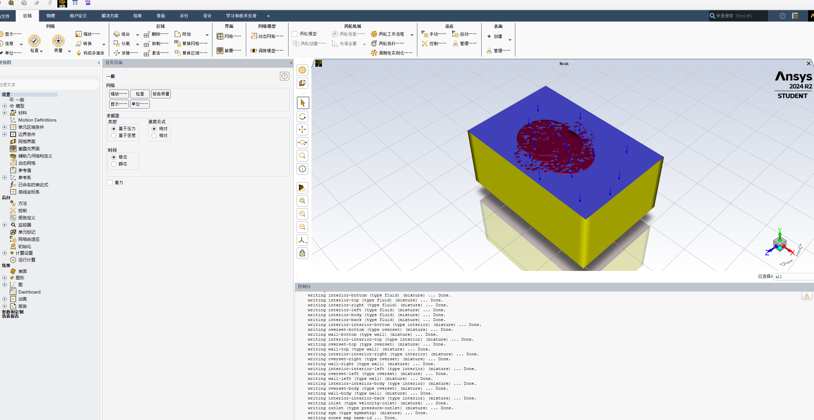
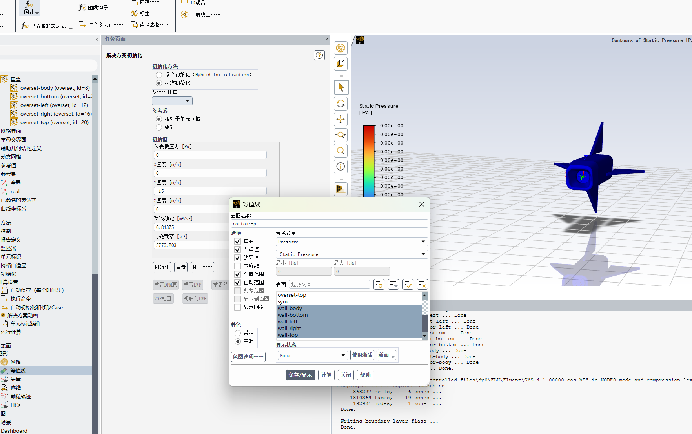
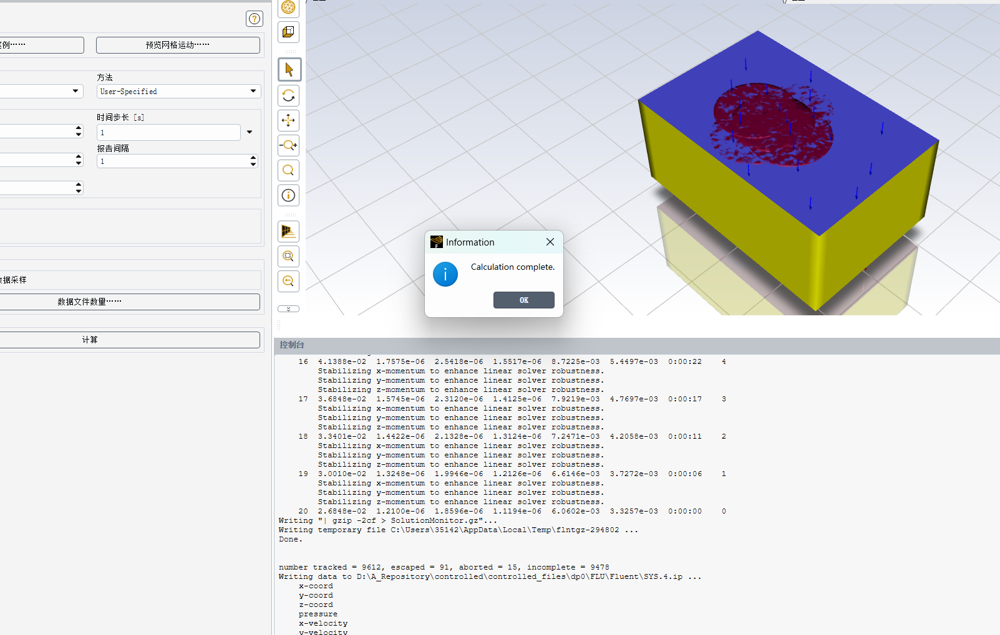

# fluent仿真流程

## 一、环境搭建

### 1. fluent的环境

由于Ansys Fluent版本和后续编译器的版本有匹配问题，所以，建议上Ansys官网下载最新的Ansys Fluent，使用免费的学生版，网址的链接如下：

[[面向大学师生和研究人员的免费仿真软件助益高校工程仿真教学 | Ansys](https://www.ansys.com/zh-cn/academic)](https://www.ansys.com/zh-cn/products/fluids/ansys-fluent)

### 2. 补充fluent安装（或者是Ansys的安装）

由于学生版会有限制，所以采用了破解版（淘宝买的）

链接：http://119.29.215.66:5244/d/%E5%A4%A9%E7%BF%BC%E4%BA%91%E7%9B%98/ANS1/Ansys242.zip

不好说什么时候会失效蛤（已经失效了，如果需要，请找当事人拿）

#### 2.1 XDown的加速

就是如果直接拿edge自带的去下载的话，速度会比较慢，所以采用这个去加速（好用）

链接：https://www.xdown.org/

对比图：


#### 2.2 Ansys安装产品选择

等下载解压缩完的话，运行file文件夹下的setup.exe。

然后就是ansys的安装产品选择

因为如果全选的话，一个是用不上，一个是占用太大空间了（完整的能有70+G），所以如果只做气动仿真的话，安装下面的就行


可以看到，Additional Tools勾选上，Design里面勾选SpaceClaim，Fluids里面勾选Ansys Dynamic Reporting，EnSight，Fluent (includes CFD-Post)，ICEM CFD，然后勾选上Other就行了。

#### 2.3 安装许可

将Files/Active/AnsysLM拷贝到C盘（任意位置，拷贝完自己记得就行），然后管理员运行里面的安装许可服务（install_license.bat)

#### 2.4 路径覆盖

将files/active里面的ansys inc拷贝到安装好的路径进行覆盖

#### 2.5 添加环境变量

变量名：ansyslmd_license_file

变量值：1055@127.0.0.1

### 3. 编译器的环境

参考于官方文档对于windows系统的编译器要求，如下：


所以还需要下载Microsoft Visual Studio2022，勾选组件如下：


由于是边勾选边测试，所以我不保证勾选的是都有用的，但是这几个勾选上是不会出错的。

## 二、机械图纸的修改

### 1. 飞镖机械图的绘制

这里先说明，本人并非机械，==请勿质疑or嘲讽我的机械设计，我会破防==。


可以看到，现在的机械图纸已经绘制完成，将不动的机身和需要进行运动的机翼分别建立实体，并分别命名（注意，命名是很重要的，如果不命名，会对后续造成比较大的麻烦），至于为什么这里的命名背后都带着1，是因为我后续需要用这个名字作为他们重叠网络的名字。

### 2. 重叠网络的绘制


在偏移平面这里，我用的是`构建`——>`偏移平面`，然后对整体的飞镖绘制back背景域，如下图：（部分机械图纸操作，并不是给机械看的，而是给后续不熟悉fusion的电控看的，机械会搞就自行跳过，禁止对我的文档发表一些没用的意见，我会破防）


注意右边这里是`新建实体`，而不是默认的`剪切`。然后在左侧调整不透明度以及back实体的名称，如下：


从顶层往下看，应该是这样包裹着的，并且最好稍微大点，如下：


然后是对body部分（也就是机身部分），进行类似操作了；


不透明度设置完，顶层往下看是这样的：


接着是对剩下四个机翼进行同样类似操作：


在勾选圆圈的时候，按住`shift`就可以多个一起选择


下图就是所有的都搞定，并且命名完的情况，之前的不带1的命名就是用于这些圆柱


### 3. 布尔操作

可以看到的是，修改这边有个合并操作（不懂sw这边的这个怎么搞），如下图：


在合并底下有三个分操作，选择剪切这个操作


其中目标实体选择body，刀具实体选择body1（对于机械来说，就是把镖体body从圆柱体body1中剪切出去），如下图：


下图就是剪切成功的，然后对四个机翼进行同样的操作：


下图就是对四个机翼剪切成功的：


然后如果文件里面包含了pcb的，就需要把body里面的pcb给他切掉（这里需要补充的是，切掉是把大的容易影响气动仿真的切掉，那些小的不容易影响气动仿真的给他隐藏掉，因为会影响后续网格的生成），所以这里我切掉的是PCB和那个大电容，然后再把pcb的实体给他隐藏掉


然后就是导出这个step（注意啊，不要把其中除了pcb的实体给他隐藏后导出来，这样在step里面属于没导）

然后也不需要分开导出，因为后续在workbench里面可以进行物理学抑制，存放地址不要放在桌面上，因为你的用户名有可能是中文或者包含数字，这个都是不支持的（因为我没有对我的桌面进行地址更换，所以地址还在我的用户名下），然后命名也不要包含中文和数字。


## 三、workbench与SpaceClaim操作

### 1. workbench操作

下载后的workbench如果找不到的话，去搜索栏里面找，就是这个Workbench 2024 R2


然后从左边的组件系统里面拖拉出六个几何结构


拖的时候可以如下：


然后再分别命名


然后右键点击几何结构，导入刚刚的step文件


然后给剩下的都导入同一个刚刚给第一个body导入的文件，可以看到问号都变成了✔


然后ctrl+s保存，保存在刚刚的controlled.step的同文件夹下面


### 2. spaceclaim操作

然后再右键点击几何结构，选择在spaceclaim中编辑几何结构


#### （1）back操作

先处理的是back，可以看到打开的页面如下：


然后点开左边的结构里面的小三角


然后先给back、body、left、top等都设置成透明的，这样可以观察镖头方向来设置入流


设置完上面的back透明后，就可以在左边把蓝色✔给他关掉 ，然后继续给别的变成透明的


然后就可以看到镖头朝着Y轴正方向


然后再把左边的back打开，，剩下的全部关掉



然后再把body给对物理分析的屏蔽


接着把除了back的剩下全部对物理分析的屏蔽，可以按下shift键一次性屏蔽几个


屏蔽完的结果如下：


接着把刚刚镖头朝向的那个面点击


再点击左侧的群组，然后点击创建NS，命名为inlet（命名不能改）


再用鼠标滚轮翻滚3d图实体，翻滚到可以点击inlet背面的那个面（y负半轴指向的那个面），点击左侧的群组，然后点击创建NS，命名为outlet（命名不能改）


再用ctrl 键点击剩下的四个面，然后点击左侧的群组，然后点击创建NS，命名为sym（命名不能改）


这样back在spaceclaim的操作就搞定了，然后直接叉掉spaceclaim

#### （2）除了back之外的操作

打开body文件的spaceclaim



然后在结构这边关闭掉除了body的，抑制掉除了body的


然后选择圆柱体表面的三个面，然后点击群组，点击创建NS，然后命名为overset-body（这个一定要记得前面是overset）


然后右键点击overset-body，然后隐藏他


然后鼠标左键划拉显示出来的body，然后点击群组，点击创建NS，然后命名为wall-body（这个一定要记得前面是wall）


然后就可以叉掉了


剩下的几个（left、right、top、bottom）都是同样的操作


## 四、workbenech与Meshing操作

继续回到刚刚那个workbench页面


### 1. workbench操作

然后选择左侧的网络给他拖拉6个出来，在原本的几何结构的旁边


然后将几何结构里面排行第二行的那个给拖拉到网络里面的第二行，这样就有一个共享的效果


将六个都拖拉完如下：


然后点击网络里面那个绿色的图标，就可以打开meshing了

### 2. Meshing操作

#### （1）命名选择

可以看到打开的页面长这样


然后点击上面的全绿色那个小方块

然后再点击这个几何体


再右键点击几何体，点击创建命名选择


然后命名为interior-back（注意命名前面一定得是 interior）


然后就可以看到左侧的命名选择下面的四个


#### （2）网格

右键点击左边的网格，插入尺寸调整


然后点击上面的那个代表边的小方块


然后按住ctrl键就可以同时下选中12条边，（如果想调整模型的方向，可以按住鼠标滚轮，调整模型位置，可以按住ctrl+鼠标滚轮）


然后点击左边黄色那个无选择，然后再点应用


可以得到如下：


然后可以点击偏差尺寸里面的无偏差，将他改成如下：


然后再改动偏差因子，这里我先随便给个5这样，可以看到右边的黄色线发生了长短不同变化


然后再点击左边的网格，以及左下角的详细信息，如下


然后更改物理首选项为CFD，再更改单元尺寸（我目前给的是0.005），如下


然后再点击上面的生成


就可以看到生成的网格了


然后查看网格质量的话，还可以更改左侧的显示风格为单元质量


然后就可以搞其他的了，其他的如下：


然后可以点击上面的截面，切开看看内部情况


这张是left的


这张是right的


这张是top的


这张是bottom的


然后可以看到workbench里面网格的每个问号都变成了✔


#### （3）不算废话的废话

这里的话就是有一个地方其实是有问题的，就是除了back之外的仿真，应该使用膨胀会更好，但是一直处理的有问题，所以暂时先没有写进来。

然后可以把左边的fluent拖拉出来，进行下一项的fluent处理


然后把网络都拖拉到设置里面如下：


然后右键点击设置，再点击更新上游组件


等待更新完成后，，点击设置那边的小标


然后勾选上Double Precision，一般来说我是改Solver Processes为4，极限好像是10（学生版），第一次启动不知道为什么底下的工作环境会在c盘，但后续会切换到D盘


## 五、Fluent操作

### 1. 基本参数配置

需要注意的是，由于学生版本的限制，如果网格数超过下面这个数，fluent是不允许进行下一步操作的


如果一切正常的话，打开fluent的是时候，控制台的输出应该如下面



然后点开左侧的单位区域条件、边界条件，如果命名没有问题的话，打开应该是这个样子的


然后点开`模型`，然后再点开底下的`粘性`，可以看到选择的是k-omega模型，


如果想要看镖体内部的构造，而不是飞镖的重叠网络，可以点开左上角的`显示`，然后，如图操作，选择了要打开的表面后，点击显示


可以看到显示的结果如下：


然后点开一般的界面，改时间稳态为瞬态，如果需要的话可以勾选上重力


然后再点击`边界条件`下面的`入口`的`inlet`


然后设置完速度大小（假如我给他15m/s），再点击应用


然后点击初始化


然后点击`从······计算`，然后选择`inlet`


然后如果想要加上攻角的话，就可以再改变别的坐标系的值


然后点击初始化


### 2. UDF设置（做动态流体需要的）

#### （1）什么是UDF（来自gpt的回答）

UDF（User-Defined Function，用户自定义函数）是指在计算流体力学（CFD）软件中，用户根据特定需求编写的自定义代码，用于扩展和定制软件的功能。特别是在像 **ANSYS Fluent** 这样的流体模拟软件中，UDF 允许用户通过编程来定义一些标准功能无法实现的复杂物理模型、边界条件或源项等。

UDF 可以用 **C 语言** 编写，并且可以实现多种功能，例如：

- 自定义流体属性（如密度、粘度等）。
- 自定义源项（如热源、质量源等）。
- 定义新的边界条件或初始条件。
- 控制求解器的行为。
- 设置特定的求解控制参数。

在 ANSYS Fluent 中，UDF 可以通过 **Fluent 的编译器** 或 **解释器** 来加载和执行，帮助用户实现更复杂的模拟需求。

#### （2）UDF的操作

在原本的D:\controlled目录底下，新建五个.c文件，如下图所示


然后其中的body.c的代码如下：

```c
#include "udf.h"
#include "sg_mem.h"
#include "dynamesh_tools.h"

DEFINE_CG_MOTION(body,dt,vel,omega,time,dtime)
{
    vel[0] = 0;
    vel[1] = 0;
    vel[2] = 0;

    omega[0] = 0;
    omega[1] = 0;
    omega[2] = 0;
}
```

left.c的代码如下：

```c
#include "udf.h"
#include "sg_mem.h"
#include "dynamesh_tools.h"
#define PI 3.1415926 //定义了圆周率常量
#define n 4 // 设定了振动的频率

double Flap_left = PI / 6; //表示翼的最大拍打角
double Rotate_left = PI * 5 / 18; //表示翼的最大旋转角度
double w_left = 2 * PI * n; //圆周频率

DEFINE_CG_MOTION(left, dt, vel, omega, time, dtime)
{
    NV_S(vel, =, 0.0);//初始化速度和角速度为 0
    NV_S(omega, =,0.0);

    real left_angle;//计算当前时间的拍打角度，使用正弦函数来表示周期性运动。
    left_angle = Flap_left * sin(w_left * time);

    real left_anglev;//计算当前时间的拍打角速度，使用余弦函数来表示角速度。
    left_anglev = Flap_left * w_left * cos(w_left * time);

    real left_roangle;//计算当前时间的旋转角度，表示翼的旋转运动。
    left_roangle = Rotate_left * sin(w_left * time);

    real left_roanglev;//计算当前时间的旋转角速度，表示旋转运动的角速度。
    left_roanglev = Rotate_left * w_left * cos(w_left * time);

    omega[0] = 0.0;//设置物体绕X轴的角速度
    omega[1] = left_anglev;//设置物体绕Y轴的角速度
    omega[2] = 0.0;//设置物体绕Z轴的角速度

    vel[0] = 0.0;//设置X轴沿着X轴的线速度
    vel[1] = 0.0;//设置Y轴沿着X轴的线速度
    vel[2] = 0.0;//设置Z轴沿着X轴的线速度
}
```

right.c的代码如下：

```C
#include "udf.h"
#include "sg_mem.h"
#include "dynamesh_tools.h"
#define PI 3.1415926
#define n 4

double Flap_right = PI / 6;
double Rotate_right = PI * 5 / 18;
double w_right = 2 * PI * n;

DEFINE_CG_MOTION(right, dt, vel, omega, time, dtime)
{
    NV_S(vel, =, 0.0);
    NV_S(omega, =,0.0);

    real right_angle;
    right_angle = Flap_right * sin(w_right * time);

    real right_anglev;
    right_anglev = Flap_right * w_right * cos(w_right * time);

    real right_roangle;
    right_roangle = Rotate_right * sin(w_right * time);

    real right_roanglev;
    right_roanglev = Rotate_right * w_right * cos(w_right * time);

    omega[0] = 0.0;
    omega[1] = -right_anglev;
    omega[2] = 0.0;

    vel[0] = 0.0;
    vel[1] = 0.0;
    vel[2] = 0.0;
}

```

top.c代码如下：

```c
#include "udf.h"
#include "sg_mem.h"
#include "dynamesh_tools.h"
#define PI 3.1415926
#define n 4 // 设定了振动的频率

double top_fm = PI / 6; // half of flapping angle of wing
double top_rm = PI * 5 / 18; // half of rotation angle of wing
double top_w = 2 * PI * n; // circular frequency

DEFINE_CG_MOTION(top, dt, vel, omega, time, dtime)
{
    NV_S(vel, =, 0.0); // 初始化速度和角速度
    NV_S(omega, =, 0.0);

    real top_f; // 当前时间的拍打角度
    top_f = top_fm * sin(top_w * time);

    real top_f2; // 当前时间的拍打角速度
    top_f2 = top_fm * top_w * cos(top_w * time);

    real top_r; // 当前时间的旋转角度
    top_r = top_rm * sin(top_w * time);

    real top_r2; // 当前时间的旋转角速度
    top_r2 = top_rm * top_w * cos(top_w * time);

    omega[0] = 0.0;
    omega[1] = top_f2; // 右翅的角速度与左翅方向相反
    omega[2] = 0.0;

    vel[0] = 0.0; // 设置物体的线速度
    vel[1] = 0.0;
    vel[2] = 0.0;
}
```

bottom.c代码如下：

```c
#include "udf.h"
#include "sg_mem.h"
#include "dynamesh_tools.h"
#define PI 3.1415926
#define n 4 // 设定了振动的频率

double bottom_fm = PI / 6;
double bottom_rm = PI * 5 / 18;
double bottom_w = 2 * PI * n;

DEFINE_CG_MOTION(bottom, dt, vel, omega, time, dtime)
{
    NV_S(vel, =, 0.0);
    NV_S(omega, =, 0.0);

    real bottom_f;
    top_f = bottom_fm * sin(bottom_w * time);

    real top_f2;
    top_f2 = bottom_fm * bottom_w * cos(bottom_w * time);

    real bottom_r;
    top_r = bottom_rm * sin(bottom_w * time);

    real bottom_r2;
    top_r2 = bottom_rm * bottom_w * cos(bottom_w * time);

    omega[0] = 0.0;
    omega[1] = -bottom_f2;
    omega[2] = 0.0;

    vel[0] = 0.0;
    vel[1] = 0.0;
    vel[2] = 0.0;
}
```

注意其中一点就是，代码里面不能包含中文，哪怕注释里面包含中文都不行，如下图：


然后将所有的代码都改成GBK后，点击`用户定义`，再点击`函数`，然后再点击编译


接着点击`添加`，然后将几个代码都添加进来


这是添加成功的图片


然后点击`构建`，构建成功的控制台输出如下

可以看到有一行 `C sources: ['body.c', 'bottom.c', 'left.c', 'right.c', 'top.c']`


然后点击`载荷`，下载成功的控制台输出如下：可以看到有body  bottom  left  right  top   Done.


然后点击左侧的`动态网络`


然后点击`任务页面`的`创建/编辑`，如下：


然后在`运动UDF/离散分布`那边选择body：：libudf，然后区域那边选择，interior-body，然后点击创建：


然后在`运动UDF/离散分布`那边选择body：：libudf不动，然后区域那边选择，overset-body，然后点击创建：


然后在`运动UDF/离散分布`那边选择body：：libudf不动，然后区域那边选择，wall-body，然后点击创建：


其余的left、right、top、bottom都是这么操作，全部操作完如图


然后把动态网格区域叉掉，点击`显示区域运动`


然后再把overset的重叠网络部分视作不可见，步骤数设置低一点


然后点击预览，你就可以看到你的udf设置的方向等问题是不是正确的


然后在预览的时候，发现坐标轴的原点有点偏离的镖体中心，就可以在左侧的参考系里面新建一个坐标系，下面那张图原点就在中心了。


然后在`任务页面`里面的`创建/编辑······`里面，同样把每个都修改为Z[m]为-0.022


#### （3）仿真数据获取

点击左侧的`图形`，然后点击`等值线`，选择新建，然后根据你需要的数据，选择着色变量，然后一般来说是把wall的表面给他勾选上（毕竟看的是镖体表面的压力）


然后点击保存显示



点击左侧的`图形`，然后点击`迹线`，选择新建，着色变量选择Veelocity，然后释放表面选择wall那几个（理由同上）


然后点击`使用激活`，再点击`保存/显示`


然后如果你不需要那么密集的线（因为那样仿真要跑接近半分钟这样），可以修改`步骤`与`路径跳过`，然后再点击`使用激活`与`保存/显示`，然后从下图就能看出线稀疏了些，仿真跑起来也快了些。


然后再点击计算设置，然后右键点击`解决方案动画`，选择新建，然后将存储类型改成jpeg image（或者改成你需要的），然后点击动画对象为你需要看的，比如这里点击的是contour-p（压力图）


然后点击使用激活，然后再点击OK，，然后再叉掉，然后照着同样的流程添加动画对象为pathlines-1，如下：


然后点击运行计算


这里的数据都可以根据你自己的需求进行更改，为了防止仿真计算结束后，工程返回不回去了，所以先保存好fluent与workbench，然后复制整个工程到另一个文件夹下，然后打开新工程下的controlled.wbpj


可以看到啊，打开的是workbench的页面，然后点击Fluent的设置那边的？标，从而打开fluent，第一次打开复制的工程有可能会闪退，叉掉重新进入就好了。


然后点击左侧的`初始化`，还是修改`从······计算`，然后点击`初始化`


然后点击`运行计算`


这个时候，我不想改里面的参数的时候，我就可以直接点击`计算`了，然后下图就是仿真成功结算界面



然后就可以看到跑出来的仿真图了


如果跑完仿真没看到的话，点击左侧的图片，找到你自己创建的要看的数据，然后右键点击，选择显示


#### （4）关于仿真怎么得到压心

点击左侧的`报告`，然后点击`力`


然后修改力报告的参数如下：（关于z轴参数的修改，是因为我想得到镖体中间切面的压心数据）


然后再点击打印，可以在控制台看到压心数据


可以通过不断更改XYZ坐标的数值，得到不同切面


