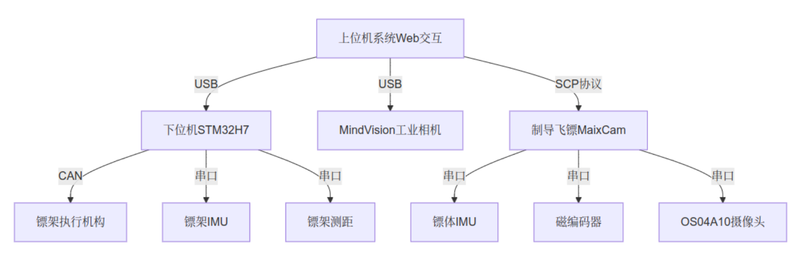

# DartGuide2025-Helios

## 一、前言

### 1.1 仓库文件目录

**DartGuide2025-Helios/**

├── **Emulation/** 	仿真

│ └──── **Guidance_algorithm/** 	制导算法仿真

│ └──── **aerodynamics/** 	Fluent空气动力学仿真

├── **Harware/** 	硬件

├── **Software/** 	软件

 │ └──── **ESP32/** 	ESP32的开发流程经验代码

 │ └──── **MaixCDK/** 	MaixCDK的代码（最新的制导版本代码代码）

 **│ └──── maixcdk的开发/** 	MaixCDK的开发经验

 **│ └──── 比例导引的计算/** 	个人对于比例导引与舵面控制的浅薄的认知

### 1.2 RM论坛开源链接，图文并茂

[【RM2025-制导飞镖开源】西南交通大学Helios战队-RoboMaster 社区](https://bbs.robomaster.com/article/715957)

[【RM2025-飞镖上位机开源】西南交通大学Helios战队-RoboMaster 社区](https://bbs.robomaster.com/article/715951?source=8)

### 1.3 bilibili视频

[我一直追寻着你，不远不近_哔哩哔哩_bilibili](https://www.bilibili.com/video/BV1nM7ezoEYX/?spm_id_from=333.1387.upload.video_card.click&vd_source=e14b6e9b1be16eabbc06175e3bbf85d0)

[真的很想见到你_哔哩哔哩_bilibili](https://www.bilibili.com/video/BV18jZNYSEhV/?spm_id_from=333.1387.upload.video_card.click&vd_source=e14b6e9b1be16eabbc06175e3bbf85d0)

### 1.4 工程的简介

​	使用 Matlab 对比例导引算法进行运动学仿真，使理论命中率提升。针对实时性要求和嵌入式算力限制，迭代过程中横向测试了 ESP32、OpenMV 及 RV1126 等平台，选择 RISC-V 架构的 MaixCam 在性能与开发速度间取得最优平衡。通过 MaixCDK 在嵌入式 Linux 环境中进行纯 C++开发，采用纯上位机处理方案，通过多线程并行处理图像识别、实时 log 记录、比例导引算法及舵面控制，重点优化了 Linux 系统下的实时性瓶颈。在嵌入式环境下以 90 FPS 实现视觉识别与调整，舵面控制延时由 2ms 降低到 0.8ms。开源文档下包含了比例导引控制算法、四舵面飞控控制、MaixCDK开发文档、Fluent开发仿真流程，及其上面所有的源码，同时包含了制导镖硬件工程。

​	同时有一套配套的上位机系统，与制导镖协同调参。github链接：[kid-king-x/Dart2025-Helios: 西南交通大学Helios战队，2025赛季的飞镖开源](https://github.com/kid-king-x/Dart2025-Helios)

### 1.5 工程框图

## 二、工程开发

为了不让README看起来太臃肿，我把关于esp32s3的idf开发的 readme 放在了

[DartGuide2025-Helios/Software/ESP32/ESP-IDF/ESP-IDF.md at main · kid-king-x/DartGuide2025-Helios](https://github.com/kid-king-x/DartGuide2025-Helios/blob/main/Software/ESP32/ESP-IDF/ESP-IDF.md)

然后maixcdk开发的 readme 放在了

[DartGuide2025-Helios/Software/maixcdk的开发/maixcdk的开发.md at main · kid-king-x/DartGuide2025-Helios](https://github.com/kid-king-x/DartGuide2025-Helios/blob/main/Software/maixcdk的开发/maixcdk的开发.md)

比例导引的算法仿真就是在matlab2024a里面就可以直接运行

Fluent空气动力学仿真的 readme 放在了这里

[DartGuide2025-Helios/Emulation/aerodynamics/fluent仿真流程 at main · kid-king-x/DartGuide2025-Helios](https://github.com/kid-king-x/DartGuide2025-Helios/tree/main/Emulation/aerodynamics/fluent仿真流程)

## 三、工程兼容性问题

> 开源协议：GPL-3.0
>
> 联系方式：qq：3514205831
