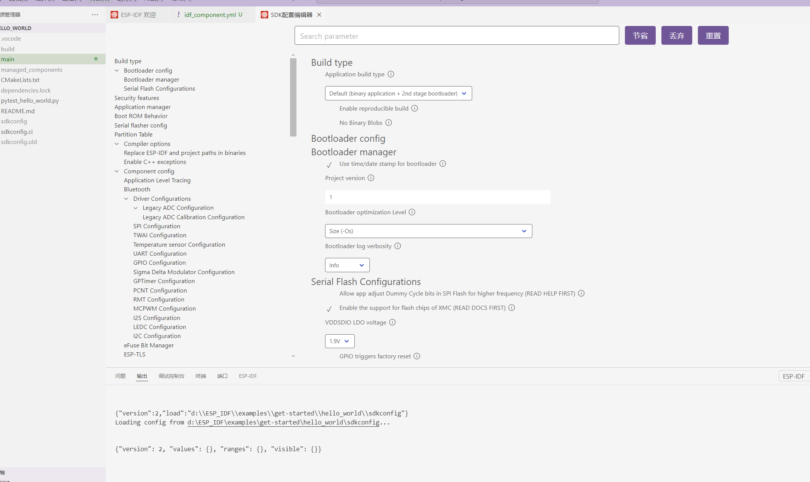
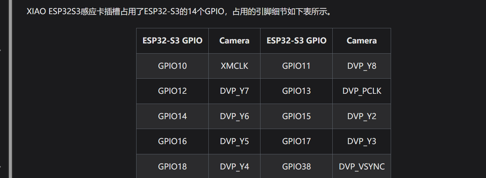

### VSCode + ESP-IDF 开发XIAO ESP32S3(Sense)以及摄像头camera ov2640（同样使用于乐鑫ESP32S3，以及其他系列的摄像头）

## 0 前言

别用~~傻逼~~逆天板子（原因见最后后言，不影响阅读）（暂未完结）

## 1 搭建环境

对照着乐鑫给出的手册来进行搭建

[ESPRESSIF]: https://docs.espressif.com/projects/esp-idf/zh_CN/v5.1/esp32s3/get-started/index.html


### 1.1 软件层面的准备

#### 1.1.1 理论（看看就行）

* 设置**工具链**，用于编译 ESP32-S3 代码；
* **编译构建工具**——CMake 和 Ninja 编译构建工具，用于编译 ESP32-S3 **应用程序**；
* 获取 **ESP-IDF** 软件开发框架。该框架已经基本包含 ESP32-S3 使用的 API（软件库和源代码）和运行 **工具链** 的脚本；

#### 1.1.2 IDE安装（选择VSCode Extension）

跟着github上的安装

#### 1.1.3 手动安装（选择Windows Installer）

跟着他安装就行

#### 1.1.4 使用命令提示符来进行编译烧录

（跟着手册问题不大）

打开Windows Installer下载好的ESP-IDF(大概率在桌面)，然后找到你想编译烧录的工程

### 操作步骤

1. **打开工程**  
   

2. **设置芯片**  
   

3. **menuconfig配置**  
     
   

4. **build构建**  
   

5. **烧录**  
   

6. **监测**  
   

#### 1.1.5 使用vscode

跟着手册构建好hello_world

然后就是手册啥都没说的配置了

* 串口配置


* 芯片配置


* 构建build


* 清除构建


* 烧录


* 构建烧录检测


##### 1.1.5.1 bug（1）


从这里打开的终端，命令行操作的时候会有报错


要从这里打开


### 2 配置摄像头

可以参考官网的esp32-camera工程，但官方，真就算只给了个模块底层（也可能我fw）

### 2.1 espressif/esp32-camera


这个就是上面的bug 1.1.5.1了，需要采用下面的那个打开终端


会在main底下生成idf_component.yml


然后记得点开看下，是不是真加入了espressif/esp32-camera


### 2.2 PSRAM


这个是最难绷的，因为官方手册中给出的PSRAM在menuconfig里面的位置和真实的位置是不一样的

#### 2.2.1 VScode自带的menuconfig（SDK配置编辑器）

就是上面那个按键



然后就是如果你根据官方给的那个顺序去找的话，大概率是找不到的，下面那个就是官方给的（和gpt给的类似）


#### 2.2.2 命令行

先点击Component config——>ESP PSRAM——>


然后是这个画面，需要按下空格后，会出现下一个画面（也是一个很折磨人的bug）

### 2.3 对照着代码改

将官方给出的四个代码片段（在README里面）Initialization，JPEG HTTP Capture，JPEG HTTP Stream，BMP HTTP Capture分别改写成.c和.h文件添加到工程里面，四个片段的TAG都要修改，最简单的就是直接替换成.h文件名字。比如TAG——>"camera"。

改完TAG，就是要对Initialization里面的14个摄像头引脚进行修改


XIAO ESP32S3 SENSE的引脚定义和乐鑫的不一样，没错，逆天的不一样


所以需要改成这样

```
#define PWDN_GPIO_NUM    -1 
#define RESET_GPIO_NUM   -1 

#define XCLK_GPIO_NUM    10
#define SIOD_GPIO_NUM    40
#define SIOC_GPIO_NUM    39
#define VSYNC_GPIO_NUM   38
#define HREF_GPIO_NUM    47
#define PCLK_GPIO_NUM    13

#define Y9_GPIO_NUM      48
#define Y8_GPIO_NUM      11
#define Y7_GPIO_NUM      12
#define Y6_GPIO_NUM      14
#define Y5_GPIO_NUM      16
#define Y4_GPIO_NUM      18
#define Y3_GPIO_NUM      17
#define Y2_GPIO_NUM      15

static camera_config_t camera_config = {
    .pin_pwdn       = PWDN_GPIO_NUM,
    .pin_reset      = RESET_GPIO_NUM,
    .pin_xclk       = XCLK_GPIO_NUM,
    .pin_sccb_sda   = SIOD_GPIO_NUM,
    .pin_sccb_scl   = SIOC_GPIO_NUM,
    .pin_d7         = Y9_GPIO_NUM,
    .pin_d6         = Y8_GPIO_NUM,
    .pin_d5         = Y7_GPIO_NUM,
    .pin_d4         = Y6_GPIO_NUM,
    .pin_d3         = Y5_GPIO_NUM,
    .pin_d2         = Y4_GPIO_NUM,
    .pin_d1         = Y3_GPIO_NUM,
    .pin_d0         = Y2_GPIO_NUM,
    .pin_vsync      = VSYNC_GPIO_NUM,
    .pin_href       = HREF_GPIO_NUM,
    .pin_pclk       = PCLK_GPIO_NUM,

    .xclk_freq_hz   = 20000000, // The clock frequency of the image sensor
    .fb_location = CAMERA_FB_IN_PSRAM, // Set the frame buffer storage location
    .pixel_format   = PIXFORMAT_JPEG, // The pixel format of the image: PIXFORMAT_ + YUV422|GRAYSCALE|RGB565|JPEG
    .frame_size     = FRAMESIZE_UXGA, // The resolution size of the image: FRAMESIZE_ + QVGA|CIF|VGA|SVGA|XGA|SXGA|UXGA
    .jpeg_quality   = 12, // The quality of the JPEG image, ranging from 0 to 63.
    .fb_count       = 2, // The number of frame buffers to use.
    .grab_mode      = CAMERA_GRAB_WHEN_EMPTY //  The image capture mode.
};
```

后面的.fb_count 也根据XIAO的板子进行了更改，更改成为了2

### 2.4 日志报错


（先删，后续再找ESP_LOGI的原本函数在哪再进行更改）

### 2.5 main.c测试代码

```
#include "camera.h"
#include "http_capture.h"
#include "http_stream.h"
#include "bmp_http_capture.h"

void app_main(void)
{
    if(ESP_OK != camera_init()){
        ESP_LOGI("main","error");
        printf("Restarting now.Error\n");
        return;
    }
    while(1)
    {
        ESP_LOGI("main","Taking picture...");
        camera_fb_t *pic = esp_camera_fb_get();

        ESP_LOGI("main", "Picture taken! Its size was: %zu bytes", pic->len);
        esp_camera_fb_return(pic);

        vTaskDelay(5000 / portTICK_PERIOD_MS);//原本 vTaskDelay(5000 / portTICK_RATE_MS);
    }
}
```

代码对照着camera_example改，里面只有一个main.c，不过我为了自己测试方便，改了些（这不重要）

### 2.6 camera_example改的代码报错

看底下报错提醒，将原本 vTaskDelay(5000 / portTICK_RATE_MS);改成 vTaskDelay(5000 / portTICK_PERIOD_MS);

上面2.5的代码是正确的

### 2.7 报错


这个就是你的PSRAM没Enable成功，返回2.2重新使能

### 2.8 PSRAM芯片未找到报错（PSRAM chip not found or not supported）


这个报错是最逆天的，就是，日志打印出来是告诉你芯片未找到，然后你会下意识觉得是你的引脚定义出错，或者是觉得和上面一样，XIAO的引脚定义和乐鑫的不一样，所以打开了一个底层库开始kuku乱改


打开了sdkconfig.old，根据这个原理图把这两个引脚改成了7与3，嘻嘻，不能用


查看完芯片的RAM，确实是8M，

==最后发现是要将SPI RAM的模式设置为八线 IO的模式==

设置方法就是紧接着2.2.2去设置如下：


### 2.9 摄像头模块设置成功的日志


## 后言

XIAO ESP32S3(Sense)这块板子，集成度确实高，整体硬件研制确实足够优雅，但是！他们家最重要的datasheet放在了文档的中间，并且左侧标题并没有给出datasheet位置，以至于对照着arduino的代码去推断他们家的引脚定义，一直到我把


这个跑出来后，才发现他们家原来给了datasheet，在这个犄角旮旯的位置


发现后，才找到原来左侧有"资源"两个字，但是数据手册的标题是"For Seeed Studio XIAO ESP32S3 Sense"，甚至下面的课程资料都比他像数据手册，乐。然后在看到这个之前，一直是对着这种图一点点扣代码扣引脚：




给出的原理图也挺不好评价的，放个图：


