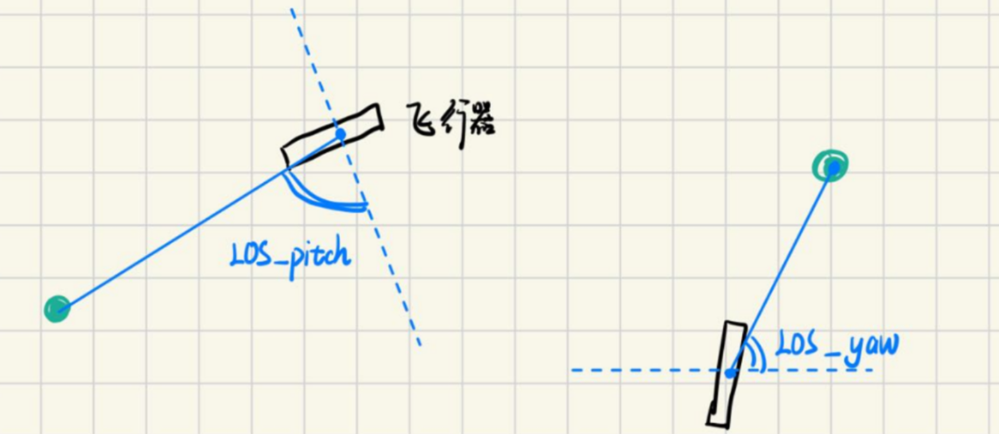

# 一、比例导引算法

## 1. 计算当前视线角

视线角（Line of Sight, LOS）计算是比例导引的核心部分，确定了目标相对于飞行器当前姿态的方位关系

### 1.1 基本概念

视线角是指从飞行器到目标的连线与某个参考轴(通常是飞行器纵轴)之间的夹角。在三维空间中，我们通常需要计算两个方向的视线角：

1. **俯仰方向视线角(LOS_pitch)**：目标在垂直平面内的角度
2. **偏航方向视线角(LOS_yaw)**：目标在水平平面内的角度



### 1.2 相机成像的几何原理

#### （1）图像宽度(W)和高度(H)(像素)

```
代码里面：
图像宽度 W: img.width() 
图像高度 H: img.height()
```

#### （2）水平视场角(FOV_h)和垂直视场角(FOV_v)

视场角（Field of View，简称 FOV）是描述传感器（如相机）观察范围的一个重要参数，用来衡量该设备在特定距离下能“看到”多宽、多高的区域。比如你站在原地看前方，你的眼睛能左右看到的角度，就是一个“水平视场角”的概念。

```
垂直视场角通过宽高比推算：FOV_v = FOV_h * (H/W)
```

```
代码里面：
水平视场角 FOV_h: h_fov
垂直视场角 FOV_v: v_fov 
```

#### （3）焦距(f)(像素单位)

焦距可以根据视场角计算得到：

```
f_x = W / (2 * tan(FOV_h/2))
f_y = H / (2 * tan(FOV_v/2))
```

```
代码里面：
focal_length_x
focal_length_y
```

### 1.3 从像素坐标到角度转换

图像坐标系以左上角为原点(0,0)。需要将其转换到以图像中心为原点的坐标系：

```
x = u - W/2
y = -(v - H/2)  // y轴向下为正，需要取反
```

```
代码里面：
x：iamge_yaw
y: image_pitch
```

### 1.4 计算视线角

根据相机几何，目标点的角度可以通过反正切函数计算：

```
θ_yaw = atan2(x, f_x)   // 偏航角
θ_pitch = atan2(y, f_y) // 俯仰角
```

### 1.5 实际计算示例

假设：

- 图像分辨率：320x240
- 水平FOV：67.38°
- 目标位置：(120, 80)

1. 计算垂直FOV：

```
v_fov = 67.38 * (240/320) = 50.535°
```

2. 计算焦距：

```
f_x = 320/(2*tan(33.69°)) ≈ 262.5 pixels
f_y = 240/(2*tan(25.2675°)) ≈ 262.5 pixels
```

3. 转换坐标系：

```
x = 120 - 160 = -40
y = -(80 - 120) = 40
```

4. 计算角度

```
θ_yaw = atan2(-40, 262.5) ≈ -8.67°
θ_pitch = atan2(40, 262.5) ≈ 8.67°
```

## 2. 计算视线角速率

视线角速率是比例导引的输入，表示目标在视野中移动的角速度：

```
LOS_rate = (当前LOS角 - 上次LOS角) / 时间间隔
```

```
代码中的实现：
float dt = (current_time - history.last_time) / 1000.0f; // 转换为秒
float raw_pitch_rate = (los_pitch - history.last_los_pitch) / dt;
float raw_yaw_rate = (los_yaw - history.last_los_yaw) / dt;
```

## 3. 低通滤波的应用

原始角速率数据通常包含噪声，需要使用低通滤波器平滑：

```
y[n] = α * x[n] + (1-α) * y[n-1]
```

其中α是滤波系数(0 < α < 1)，值越小滤波效果越强但延迟越大。

```
代码中：
los_pitch_rate = history.pitch_rate_filter.update(raw_pitch_rate);
los_yaw_rate = history.yaw_rate_filter.update(raw_yaw_rate);
```

## 4. 与飞行器姿态的融合（比例导引的实现）

**比例导引（Proportional Navigation, PN）**其核心思想是通过调整导弹的加速度（或转向指令），使得导弹的速度矢量旋转速率与目标视线（Line-of-Sight, LOS）的旋转速率成比例，从而逐渐减小视线角速度，最终实现拦截目标。

- 若目标静止或直线运动，导弹通过调整加速度使**视线角速度**趋近于0，从而沿直线或预测碰撞路径飞行。
- 若目标机动，比例导引会动态调整导弹加速度以匹配目标运动。


比例导引的基本思想是：

```
制导指令 = k_p × 视线角速率 × 接近速度
```

在代码中简化为：

```
控制量 = k_p × 视线角速率
```

最终的制导指令需要结合飞行器当前姿态：

- 俯仰通道额外补偿飞行角度，保持稳定
- 滚转通道使用直接阻尼控制

```
// 俯仰通道: 比例导引 + 飞行角度补偿
output.pitch_delta = params.k_p * los_pitch_rate - 0.15f * flight_pitch;

// 偏航通道: 与俯仰通道对称的处理方式
output.yaw_delta = params.k_p * los_yaw_rate - 0.15f * flight_yaw;

// 滚转通道: 主要用于稳定，基于当前滚转角速度
output.roll_delta = -0.5f * current_roll_rate;
```

- `k_p * los_rate`：比例导引项

- `-0.15f * flight_angle`：姿态稳定项，防止过度机动

# 二、舵面控制算法

## 1. 飞镖尾部气流方向与俯仰pitch的关系

当飞镖尾部气流向上的时候，

- **气流方向**：从 **下方** 吹向 **上方**（即相对气流与下表面形成正攻角）。

- **气动力效应**：
  - 尾部气流向上 → 尾部受到 **向上的气动力**（升力）。
  - 根据力矩原理，尾部升力会使镖头 **下压**（低头，`Pitch↓`）。
  - **反之**，如果尾部气流向下 → 镖头会上仰（抬头，`Pitch↑`）。

**同理：**

* 尾部气流向左，尾部受到向左的气动力，根据力矩原理，尾部升力会使镖头向右

## 2. 攻角静态补偿的意义

攻角补偿的目的是抵消由于飞行器攻角（Angle of Attack,）变化引起的气动力矩，使飞行器保持稳定。补偿量由**静态补偿**和**动态补偿**两部分组成，并引入**非线性项**以更精确匹配气动力特性。

* **平衡气动力矩**：当飞行器以一定的攻角飞行的时候，会产生额外的气动力矩，静态补偿可以预先抵消这部分力矩，减少PID控制器的负担

* **改善初始相应**：在没有误差积累时(PID积分项为零)，静态补偿能提供初始控制量，加快系统响应速度。

* **减小稳态误差**：对于固定攻角下的稳态飞行，静态补偿可以直接提供所需舵偏角，减少对PID积分的依赖。

* **能量效率**：相比完全依赖PID调节，静态补偿能更直接地提供所需控制量，减少不必要的舵面运动。

## 3. 攻角非线性补偿

在飞行控制中，攻角（angle of attack）与产生的气动力矩通常不是简单的正比关系。当攻角增大时，气动力矩的增长会变得越来越快，这种关系就是非线性的。

1. **小攻角时**：气动力矩变化较平缓，线性补偿足够
2. **大攻角时**：气动力矩急剧增加，需要更强的补偿
3. **临界攻角**：接近失速攻角时，力矩特性会突然变化

### 3.1 攻角补偿的参数解释

| 参数               | 典型值  | 物理意义           | 为什么这么给？                                               |
| :----------------- | :------ | :----------------- | :----------------------------------------------------------- |
| `static_comp`      | `-0.2`  | 基础静态补偿系数   | **负号**表示补偿方向与攻角相反（攻角增加→舵面反向偏转以抵消力矩） |
| `nonlinear_factor` | `0.001` | 非线性补偿因子     | 小攻角时影响小，大攻角时增强补偿（气动力矩非线性增长）       |
| `rate_comp`        | `0.05`  | 攻角变化率补偿系数 | 快速变化的攻角需要更强的补偿（防止动态失稳）                 |
| `max_comp`         | `20.0`  | 最大补偿限幅       | 防止舵面饱和（避免过度补偿导致失控）                         |
| `adapt_gain`       | `0.01`  | 自适应调整增益     | 根据误差微调补偿系数（提高鲁棒性）                           |

### 3.2 静态非线性补偿

代码（静态非线性补偿）：

```
float static_comp = angle * (adapted_comp + alpha_params.nonlinear_factor * fabs(angle));
```

1. `angle` 是当前攻角（有正负）
2. `adapted_comp` 是基础补偿系数
3. `fabs(angle)` 取攻角的绝对值（因为非线性效应与方向无关）
4. `nonlinear_factor` 是非线性因子，控制非线性强度

### 3.3 实际效果举例

假设飞行器当前攻角 `angle = 15°`，攻角变化率 `angle_rate = 5°/s`，PID 误差 `error = 8.0`（较大误差触发自适应调整）：

1. **静态补偿**：
   - `static_comp = 15 * (-0.2 + 0.001 * |15|) = 15 * (-0.2 + 0.015) = -2.775`
2. **动态补偿**：
   - `dynamic_comp = 5 * 0.05 = 0.25`
3. **自适应调整**：
   - `error > 5` → `adapted_comp -= 0.01`（假设调整后 `adapted_comp = -0.21`）
4. **总和**：
   - `total_comp = -2.775 + 0.25 = -2.525`
   - 限幅后：`-2.525`（未超过 `±20`，直接输出）

**物理意义**：攻角 `15°` 导致抬头力矩，补偿 `-2.525` 使舵面下偏以抵消力矩。

## 4. 舵面控制算法

舵面控制的目标是将制导指令（俯仰、偏航、滚转）转换为 4 个舵机的具体偏转量（X 形布局）。

### 4.1 舵面控制算法的参数解释

| 参数            | 典型值   | 物理意义                  | 为什么这么给？                         |
| :-------------- | :------- | :------------------------ | :------------------------------------- |
| `servo_neutral` | `50.0`   | 舵机中立位置（50%占空比） | 对应舵面 `0°` 偏转                     |
| `servo_min`     | `20.0`   | 舵机最小限幅              | 防止机械卡死（对应 `-30°` 偏转）       |
| `servo_max`     | `80.0`   | 舵机最大限幅              | 防止机械卡死（对应 `+30°` 偏转）       |
| `max_angle`     | `30.0`   | 最大控制角度              | 限制制导指令范围，避免过度机动         |
| `cos45`         | `0.7071` | 45°投影系数               | X 形布局舵面需按 `cos(45°)` 分配控制量 |

### 4.2 实际效果举例（结合攻角补偿）

**场景**：飞镖检测到目标在右上方，制导指令为：

- `pitch_delta = +10°`（需抬头）
- `yaw_delta = +8°`（需右转）
- `roll_delta = 0°`（保持水平）
- 当前攻角 `angle = 12°`（风标测量）
- 滚转角 `current_angle_z = -5°`（左倾斜）

其中攻角方向定义：

- **`angle > 0`**：风标向上偏转（**正攻角**，气流冲击飞镖下表面，产生**抬头力矩**）。
- **`angle < 0`**：风标向下偏转（**负攻角**，气流冲击飞镖上表面，产生**低头力矩**）。

**计算过程**：

1. **攻角补偿**：
   - 静态补偿：`12 * (-0.2 + 0.001*12) = -2.256`
   - 动态补偿：假设 `angle_rate = 3°/s → 3*0.05 = 0.15`
   - 总补偿：`-2.256 + 0.15 = -2.106`（舵面下偏抵消抬头力矩）
2. **俯仰指令**：
   - `pitch_cmd = (10 + -2.106) / 30 * 100 = 26.31%`
3. **偏航指令**：
   - `yaw_cmd = 8 / 30 * 100 = 26.67%`
4. **滚转指令**：
   - `roll_cmd = (0 + -5) / 30 * 50 = -8.33%`（修正左倾）
5. **舵面混合**（以左上舵面 `servo1` 为例）：
   - `cmd.servo1 = 50 + 0.7071*(-26.31 - 26.67) - (-8.33) ≈ 50 - 37.5 + 8.33 = 20.83`

**最终舵面指令**：

| 舵面          | 计算值                                       | 限幅后 | 物理效果 |
| :------------ | :------------------------------------------- | :----- | :------- |
| 左上 (servo1) | 20.83                                        | 20.83  | 大幅下偏 |
| 右上 (servo2) | 50 + 0.7071*(26.31-26.67) - (-8.33) ≈ 58.0   | 58.0   | 小幅下偏 |
| 右下 (servo3) | 50 + 0.7071*(-26.31+26.67) - (-8.33) ≈ 41.92 | 41.92  | 小幅上偏 |
| 左下 (servo4) | 50 + 0.7071*(26.31+26.67) - (-8.33) ≈ 95.79  | 80     | 最大上偏 |

**行器动作**：

- **俯仰**：左上舵上偏 + 右下舵下偏 → 抬头
- **偏航**：左上/右上舵上偏 + 左下/右下舵下偏 → 右转
- **滚转**：右上/左下舵小幅上偏修正左倾

通过攻角补偿，舵面在抬头指令中自动减少上偏幅度（`-2.106` 补偿），避免因大攻角导致过度抬头失速。

### 4.3 servo_calculate计算示例

假设我们有以下输入参数：

- `control.pitch_delta` = 10.0 (度)
- `control.yaw_delta` = 5.0 (度)
- `control.roll_delta` = -2.0 (度)
- `gyro_x` = 15.0 (度/秒，俯仰角速度)
- `gyro_y` = -8.0 (度/秒，滚转角速度)
- `gyro_z` = 3.0 (度/秒，偏航角速度)
- `current_time` = 1000 (ms)
- `angle_of_attack` = 12.0 (度)

#### 计算步骤

1. **计算时间步长(dt)**
   - 假设上一次调用时间`last_time`=900ms
   - `dt = (1000 - 900)/1000.0 = 0.1秒`
2. **计算误差**
   - `error = setpoint - measurement = 10.0 - 15.0 = -5.0`
3. **积分项计算**
   - 假设当前`integral`=2.0
   - `integral += error * dt = 2.0 + (-5.0)*0.1 = 1.5`
   - 限幅后`integral`=1.5 (在±50范围内)
4. **微分项计算**
   - 假设上一次误差`prev_error`=8.0
   - `derivative = (error - prev_error)/dt = (-5.0 - 8.0)/0.1 = -130.0`
5. **攻角补偿计算**
   - 假设上一次角度`last_angle`=10.0度
   - 攻角变化率`angle_rate = (12.0 - 10.0)/0.1 = 20.0度/秒`
   - 静态非线性补偿:
     - `static_comp = angle * (adapted_comp + nonlinear_factor * |angle|)`
     - 假设`adapted_comp`=-0.2
     - `static_comp = 12.0 * (-0.2 + 0.001 * 12.0) = 12.0 * (-0.188) = -2.256`
   - 动态速率补偿:
     - `dynamic_comp = angle_rate * rate_comp = 20.0 * 0.05 = 1.0`
   - 自适应调整:
     - 因为|error|=5.0 > 5.0，需要调整
     - `adapted_comp += adapt_gain * (error>0 ? -1 : 1) = -0.2 + 0.01 * 1 = -0.19`
     - 限幅后`adapted_comp`=-0.19 (在-0.3到-0.1之间)
   - 总补偿:
     - `total_comp = -2.256 + 1.0 = -1.256`
     - 限幅后`total_comp`=-1.256 (在±20范围内)
6. **PID输出计算**
   - `output = Kp*error + Ki*integral + Kd*derivative + compensation`
   - `output = 0.8*(-5.0) + 0.05*1.5 + 0.1*(-130.0) + (-1.256)`
   - `output = -4.0 + 0.075 - 13.0 - 1.256 = -18.181`
   - 限幅后`output`=-18.181 (在±100范围内)
7. **应用pitch_kp比例**
   - `pitch_cmd = output * pitch_kp = -18.181 * 0.3 = -5.4543`
